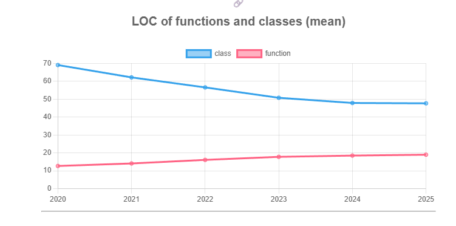

# 1. Repositório selecionado

``` https://github.com/home-assistant/core ```

# 2. Gráfico selecionado: LOC of functions and classes (mean)



# 3. Explicação:

A redução no tamanho médio das classes é extremamente positiva do ponto de vista das boas práticas de programação. Classes menores tendem a ter responsabilidades mais específicas, facilitando a manutenção, promovendo melhor encapsulamento e proporcionando maior clareza na separação de responsabilidades.

Observa-se uma tendência consistente de diminuição no tamanho médio das classes, que caíram de aproximadamente 70 para cerca de 50 linhas ao longo do período analisado, o que é um indicativo de aprimoramento na qualidade do código. Em contrapartida, as funções apresentaram um leve crescimento em tamanho, mas permanecem dentro de limites bastante aceitáveis: com até 15 linhas, continuam sendo curtas, legíveis e de fácil gerenciamento.

Esses resultados sugerem a adoção de boas práticas de desenvolvimento, como refatoração contínua, utilização de métodos mais enxutos e foco na legibilidade e manutenção do código.

